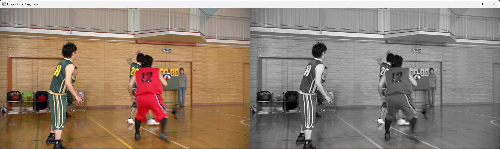

# 이미지 불러오기 및 그레이스케일 변환

## 개요
OpenCV를 사용하여 원본 이미지를 불러오고, 그레이스케일로 변환한 후 두 이미지를 비교하여 출력하는 과정을 수행함.

## 파일 경로
- 원본 이미지: `./data/image.png`
- 결과 이미지: `./data/result1.png`

## 실험 과정
1. OpenCV의 `cv2.imread()`를 사용하여 원본 이미지를 불러옴.
2. `cv2.cvtColor()`를 사용하여 이미지를 그레이스케일로 변환함.
3. `np.hstack()`을 이용하여 원본 이미지와 그레이스케일 이미지를 가로로 연결함.
4. `cv2.imshow()`를 사용하여 변환된 결과를 출력하고, 키 입력을 대기하여 창을 닫음.
5. 최종 결과를 `cv2.imwrite()`을 사용하여 `./data/result1.png`로 저장함.

## 사용된 코드
```python
import cv2
import numpy as np

# 이미지 로드
image = cv2.imread("./data/image.png")
if image is None:
    print("이미지를 불러올 수 없습니다.")
    exit()

# 그레이스케일 변환
gray_image = cv2.cvtColor(image, cv2.COLOR_BGR2GRAY)

# 원본과 그레이스케일 이미지를 가로로 연결
combined_image = np.hstack((image, cv2.cvtColor(gray_image, cv2.COLOR_GRAY2BGR)))

# 결과 이미지 저장
cv2.imwrite("./data/result1.png", combined_image)

# 이미지 출력
cv2.imshow("Original and Grayscale", combined_image)
cv2.waitKey(0)
cv2.destroyAllWindows()
```

## 결과
아래 이미지는 원본 이미지(좌측)와 변환된 그레이스케일 이미지(우측)를 비교한 결과.



## 결론
OpenCV를 사용하여 이미지를 불러오고, 그레이스케일 변환을 수행하는 과정을 실습하였다. 결과적으로 원본 이미지와 그레이스케일 이미지를 나란히 배치하여 비교할 수 있었다.
