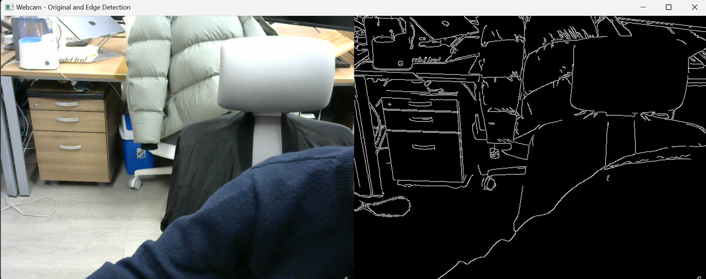

# 웹캠 영상을 이용한 에지 검출

## 개요
OpenCV를 활용하여 실시간 웹캠 영상을 받아오고, Canny Edge Detection을 적용하여 원본 영상과 에지 검출된 영상을 비교하는 과정을 수행함.

## 파일 경로
- 원본 이미지: `./data/image.png`
- 결과 이미지: `./data/result2.png`

## 실험 과정
1. OpenCV의 `cv2.VideoCapture()`를 사용하여 웹캠을 실행하고 영상을 받아옴.
2. `cv2.cvtColor()`를 이용하여 각 프레임을 그레이스케일로 변환함.
3. `cv2.Canny()`를 적용하여 영상의 엣지를 검출함.
4. `np.hstack()`을 사용하여 원본 영상과 에지 검출된 영상을 가로로 연결함.
5. `cv2.imshow()`를 이용하여 실시간으로 변환된 영상을 출력함.
6. 사용자가 `q` 키를 입력하면 웹캠을 종료하고 `cv2.imwrite()`을 사용하여 최종 결과를 `./data/result2.png`로 저장함.

## 사용된 코드
```python
import cv2
import numpy as np

# 웹캠 실행
cap = cv2.VideoCapture(0)
if not cap.isOpened():
    print("웹캠을 열 수 없습니다.")
    exit()

while True:
    ret, frame = cap.read()
    if not ret:
        break
    
    # 그레이스케일 변환
    gray = cv2.cvtColor(frame, cv2.COLOR_BGR2GRAY)
    
    # Canny 에지 검출 적용
    edges = cv2.Canny(gray, 100, 200)
    
    # 원본과 에지 영상 가로로 연결
    combined = np.hstack((frame, cv2.cvtColor(edges, cv2.COLOR_GRAY2BGR)))
    
    # 화면 출력
    cv2.imshow("Webcam - Original and Edge Detection", combined)
    
    # 'q' 키 입력 시 종료 및 이미지 저장
    if cv2.waitKey(1) & 0xFF == ord('q'):
        cv2.imwrite("./data/result2.png", combined)
        print("결과 이미지 저장 완료: result2.png")
        break

cap.release()
cv2.destroyAllWindows()
```

## 결과
아래 이미지는 웹캠을 통해 캡처된 원본 영상(좌측)과 Canny Edge Detection이 적용된 영상(우측)임.



## 결론
본 실험을 통해 OpenCV를 사용하여 실시간 웹캠 영상을 처리하고, Canny Edge Detection을 적용하여 영상에서 주요 윤곽선을 추출하는 방법을 실습하였다. 이를 통해 실시간 에지 검출이 가능함을 확인할 수 있었다.
