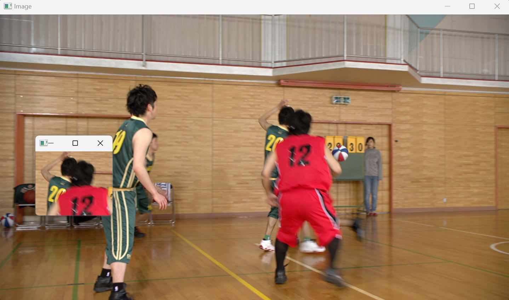

# 마우스를 이용한 관심 영역(ROI) 선택 및 추출

## 개요
OpenCV를 활용하여 사용자가 마우스로 원하는 영역을 선택하고, 선택한 관심영역(ROI)을 별도의 창에 출력하거나 저장하는 기능을 구현함.

## 파일 경로
- 원본 이미지: `./data/image.png`
- 결과 이미지: `./data/result3.png`

## 실험 과정
1. OpenCV의 `cv2.imread()`를 사용하여 이미지를 불러옴.
2. `cv2.setMouseCallback()`을 이용하여 마우스 이벤트를 처리함.
3. 사용자가 마우스로 클릭 후 드래그하면 사각형으로 영역을 표시함.
4. 마우스를 놓으면 해당 영역을 ROI로 잘라내어 별도의 창에 출력함.
5. `r` 키를 누르면 선택된 영역을 초기화하고 다시 선택할 수 있음.
6. `s` 키를 누르면 선택한 영역을 `./data/result3.png` 파일로 저장함.

## 사용된 코드
```python
import cv2
import numpy as np

# 이미지 로드
image = cv2.imread("./data/image.png")
clone = image.copy()
roi = None
selecting = False
start_x, start_y = -1, -1

# 마우스 콜백 함수
def select_roi(event, x, y, flags, param):
    global start_x, start_y, roi, selecting, image
    
    if event == cv2.EVENT_LBUTTONDOWN:
        start_x, start_y = x, y
        selecting = True
    
    elif event == cv2.EVENT_MOUSEMOVE:
        if selecting:
            temp = image.copy()
            cv2.rectangle(temp, (start_x, start_y), (x, y), (0, 255, 0), 2)
            cv2.imshow("Image", temp)
    
    elif event == cv2.EVENT_LBUTTONUP:
        selecting = False
        roi = clone[start_y:y, start_x:x]
        cv2.imshow("ROI", roi)

# 창 및 마우스 이벤트 설정
cv2.namedWindow("Image")
cv2.setMouseCallback("Image", select_roi)

while True:
    cv2.imshow("Image", image)
    key = cv2.waitKey(1) & 0xFF
    
    if key == ord("r"):  # 영역 초기화
        image = clone.copy()
        roi = None
        cv2.destroyWindow("ROI")
    elif key == ord("s") and roi is not None:  # ROI 저장
        cv2.imwrite("./data/result3.png", roi)
        print("ROI 저장 완료: result3.png")
    elif key == ord("q"):  # 종료
        break

cv2.destroyAllWindows()
```

## 결과
아래 이미지는 마우스를 사용하여 선택된 관심영역(ROI)임.



## 결론
본 실험을 통해 OpenCV에서 마우스 이벤트를 활용하여 관심영역(ROI)을 선택하고, 이를 저장하는 방법을 실습하였다. 이를 통해 이미지 처리에서 특정 영역을 선택하여 활용할 수 있는 기술을 익힐 수 있었다.
