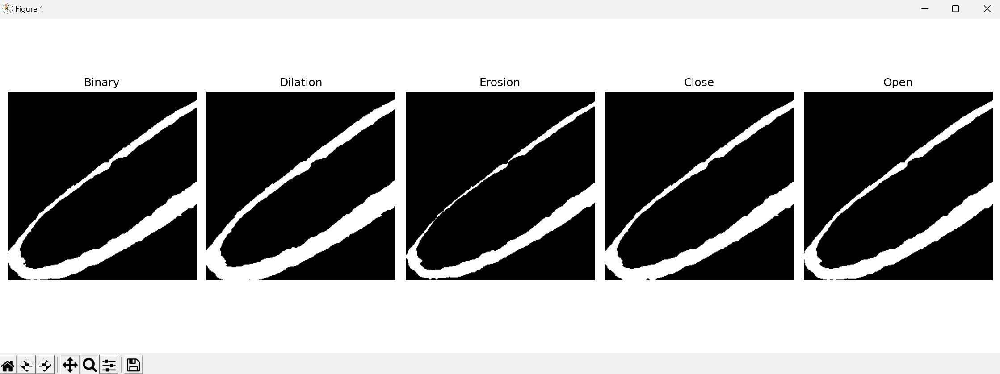

# Vision Processing Basic Report

## 📁 Introduction
본 보고서는 세 가지 OpenCV 과제에 대한 구현 및 결과를 정리한 문서입니다. 각 과제의 요구사항에 따라 Python으로 작성한 코드를 설명하고, 결과 이미지를 포함하였습니다. 결과 이미지는 각 과제의 실행 결과를 시각적으로 보여줍니다.

---

## 📝 과제 1: 엣지 검출 적용하기
### 📄 설명
주어진 이미지를 사용하여 엣지 검출을 수행합니다. Canny Edge Detection을 사용하여 경계선을 추출합니다.

### 🔧 요구사항
- OpenCV의 `cv2.Canny()` 함수를 이용하여 엣지 검출을 수행합니다.
- 엣지 검출 전, Gaussian Blur를 적용하여 노이즈를 제거합니다.

### 💻 코드
```python
import cv2

image = cv2.imread('image.png', cv2.IMREAD_GRAYSCALE)
blurred = cv2.GaussianBlur(image, (5, 5), 0)
edges = cv2.Canny(blurred, 100, 200)
cv2.imwrite('./data/result1.png', edges)
```

### 🖼️ 결과 이미지


---

## 📝 과제 2: 모폴로지 연산 적용하기
### 📄 설명
주어진 이진화된 이미지에 대해 팽창, 침식, 열림, 닫힘 연산을 적용합니다.

### 🔧 요구사항
- `cv2.getStructuringElement()`를 이용하여 커널을 생성합니다.
- `cv2.morphologyEx()`를 사용하여 각 모폴로지 연산을 수행합니다.

### 💻 코드
```python
import cv2
import numpy as np

image = cv2.imread('image.png', cv2.IMREAD_GRAYSCALE)
kernel = cv2.getStructuringElement(cv2.MORPH_RECT, (5, 5))
dilation = cv2.morphologyEx(image, cv2.MORPH_DILATE, kernel)
erosion = cv2.morphologyEx(image, cv2.MORPH_ERODE, kernel)
opening = cv2.morphologyEx(image, cv2.MORPH_OPEN, kernel)
closing = cv2.morphologyEx(image, cv2.MORPH_CLOSE, kernel)
cv2.imwrite('./data/result2.png', np.hstack((dilation, erosion, opening, closing)))
```

### 🖼️ 결과 이미지


---

## 📝 과제 3: 기하 연산 및 선형 보간 적용하기
### 📄 설명
이미지를 45도 회전 후 1.5배 확대하고, 선형 보간을 통해 부드럽게 표현합니다.

### 🔧 요구사항
- `cv2.getRotationMatrix2D()`를 사용하여 회전 행렬을 생성합니다.
- `cv2.warpAffine()`를 사용하여 이미지를 회전합니다.
- `cv2.resize()`와 `cv2.INTER_LINEAR`를 통해 확대와 보간을 수행합니다.

### 💻 코드
```python
import cv2
import numpy as np

image = cv2.imread('image.png')
rows, cols = image.shape[:2]
matrix = cv2.getRotationMatrix2D((cols / 2, rows / 2), 45, 1)
rotated = cv2.warpAffine(image, matrix, (cols, rows))
scaled = cv2.resize(rotated, (int(cols * 1.5), int(rows * 1.5)), interpolation=cv2.INTER_LINEAR)
cv2.imwrite('./data/result3.png', scaled)
```

### 🖼️ 결과 이미지


---

## 📌 결론
세 과제 모두 OpenCV의 다양한 연산 기법을 활용하여 이미지 처리의 기초적인 내용을 다루었습니다. 엣지 검출을 통한 경계선 추출, 모폴로지 연산을 통한 이미지 변형, 기하 연산을 통한 이미지 변환 등의 기술을 실습하였습니다.
