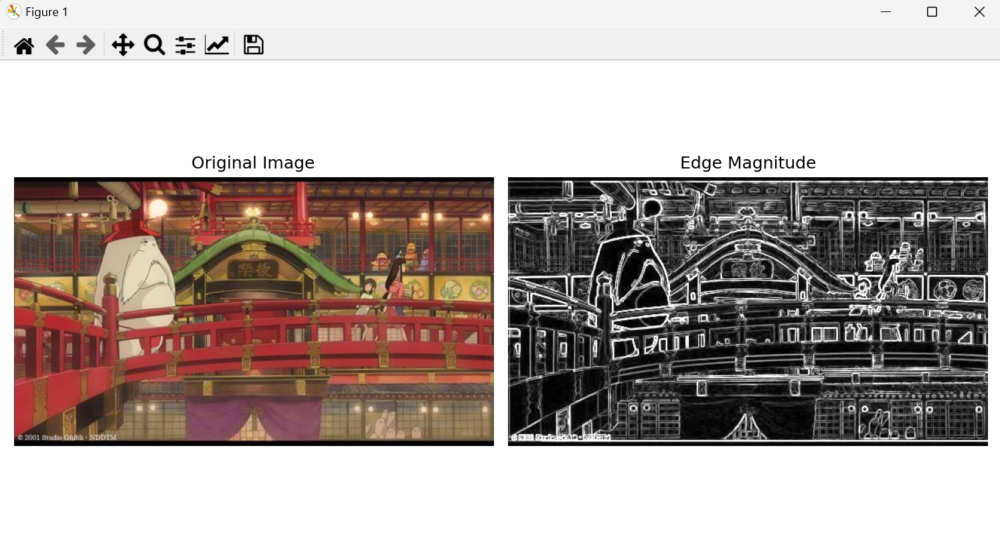
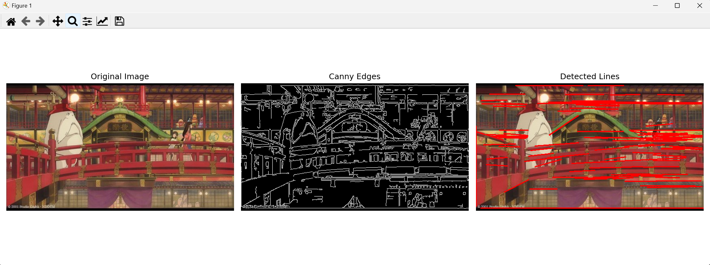
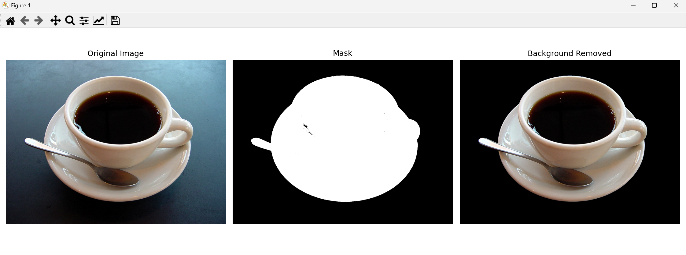

# Computer Vision Report: Edge Detection and Object Segmentation

## 과제 개요

이 프로젝트는 컴퓨터 비전 기법을 활용하여 주어진 이미지에서 에지 검출과 객체 분할을 수행하고, 그 결과를 시각화 및 분석하는 것을 목표로 합니다.

---

## 01. 소벨 에지 검출 및 결과 시각화

- 입력 이미지를 그레이스케일로 변환
- `Sobel` 필터를 이용해 X축, Y축 방향의 에지를 검출
- `cv2.magnitude`를 사용해 에지 강도를 계산하고 시각화

### 사용 함수
- `cv2.Sobel()`
- `cv2.convertScaleAbs()`
- `cv2.magnitude()`

### 결과 이미지  

---

## 02. 캐니 에지 및 허프 변환을 이용한 직선 검출

- `Canny` 알고리즘으로 에지 맵 생성
- `Hough Transform (cv2.HoughLinesP)`을 통해 직선 검출
- 검출된 직선을 원본 이미지 위에 빨간색으로 표시

### 사용 함수
- `cv2.Canny()`
- `cv2.HoughLinesP()`
- `cv2.line()`

### 결과 이미지  

---

## 03. GrabCut을 이용한 대화식 영역 분할 및 객체 추출

- 사용자가 지정한 사각형 영역을 기준으로 `GrabCut` 수행
- 생성된 마스크를 활용해 객체만 남기고 배경 제거
- 마스크와 객체 추출 결과를 시각화

### 사용 함수
- `cv2.grabCut()`
- `np.where()`

### 결과 이미지  

---

## 결론

각 기법은 이미지에서 중요한 정보를 추출하거나 노이즈를 제거하는 데 유용하게 쓰입니다:

- **Sobel**: 기본적인 엣지 구조 파악
- **Canny + Hough**: 구조화된 직선 검출
- **GrabCut**: 반자동 객체 분할

> 위 결과 이미지는 `./data/result1.png`, `result2.png`, `result3.png`에 저장되어 있습니다.
