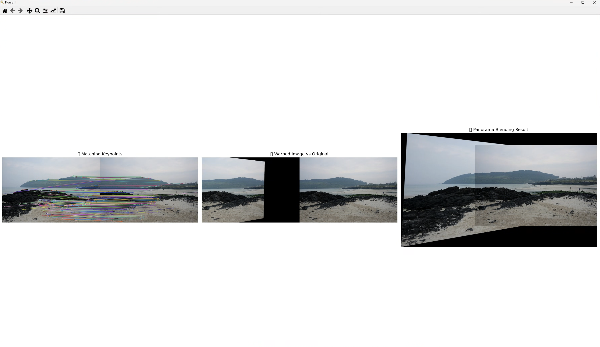

# Computer Vision Report: SIFT 기반 특징점 검출 및 이미지 정합

## 과제 개요

이 프로젝트는 OpenCV의 SIFT 알고리즘을 활용하여 이미지 내 특징점을 검출하고, 이를 기반으로 이미지 간의 매칭 및 정합을 수행하는 것이 목적입니다.  
총 3개의 실습으로 구성되어 있으며, 각 단계는 특징점 추출, 매칭, 그리고 호모그래피 기반 정렬로 이어집니다.

---

## 01. SIFT 특징점 검출 및 시각화

- 입력 이미지를 그레이스케일로 변환
- `cv2.SIFT_create()`를 사용해 특징점 검출
- `cv2.drawKeypoints()`를 통해 방향 및 크기를 포함한 키포인트 시각화

### 사용 함수
- `cv2.imread()`, `cv2.cvtColor()`
- `cv2.SIFT_create()`
- `cv2.drawKeypoints()`

### 결과 이미지  

---

## 02. SIFT 기반 이미지 간 특징점 매칭

- 두 이미지에서 SIFT 특징점을 검출
- `BFMatcher`를 사용해 유사한 특징점 매칭
- Top 50개의 매칭 결과를 이미지 상에 시각화

### 사용 함수
- `cv2.BFMatcher()`, `cv2.drawMatches()`

### 결과 이미지  

---

## 03. SIFT + 호모그래피를 이용한 이미지 정합

- SIFT로 추출한 특징점 간 매칭을 기반으로 `findHomography()`로 호모그래피 행렬 계산
- `cv2.warpPerspective()`로 한 이미지를 다른 이미지 위에 정렬
- 매칭된 포인트 시각화 및 정합 결과 비교

### 사용 함수
- `cv2.findHomography()` (`RANSAC` 기반)
- `cv2.warpPerspective()` (흰색 배경 지정: `borderValue=(255,255,255)`)
- `cv2.drawMatches()`, `np.hstack()`

### 결과 이미지  

---

## 결론

- **과제 1**: SIFT는 객체의 위치, 스케일, 방향에 강인한 특징점 추출이 가능함을 확인
- **과제 2**: 이미지 간 시각적 유사성이 클수록 정확한 매칭이 가능함
- **과제 3**: 호모그래피 변환을 통해 두 이미지를 공간적으로 정합할 수 있었으며, RANSAC이 이상치 제거에 효과적이었음

> 각 과제 결과는 `./data/result1.png`, `result2.png`, `result3.png`로 저장되어 있습니다.

