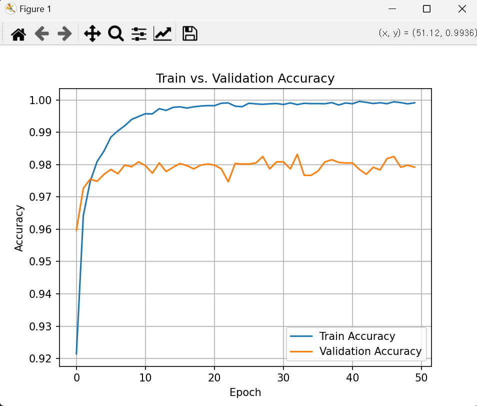
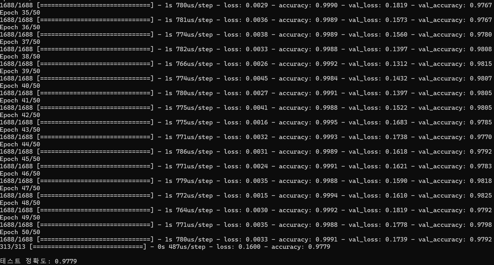
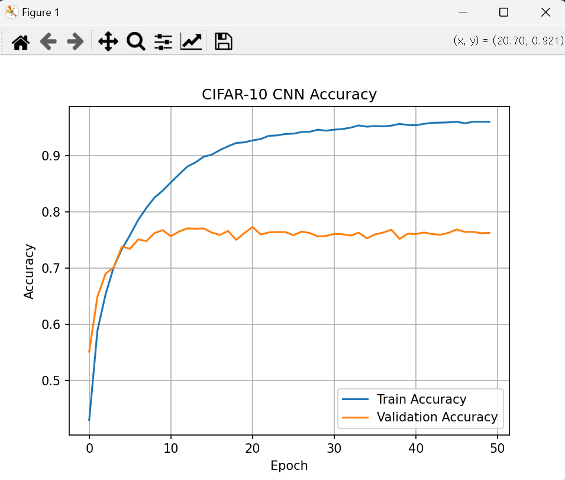
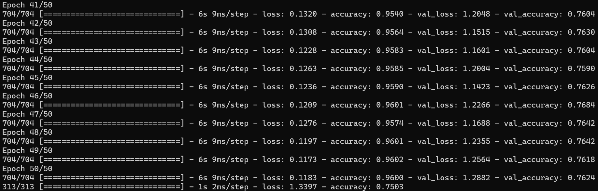
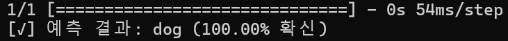
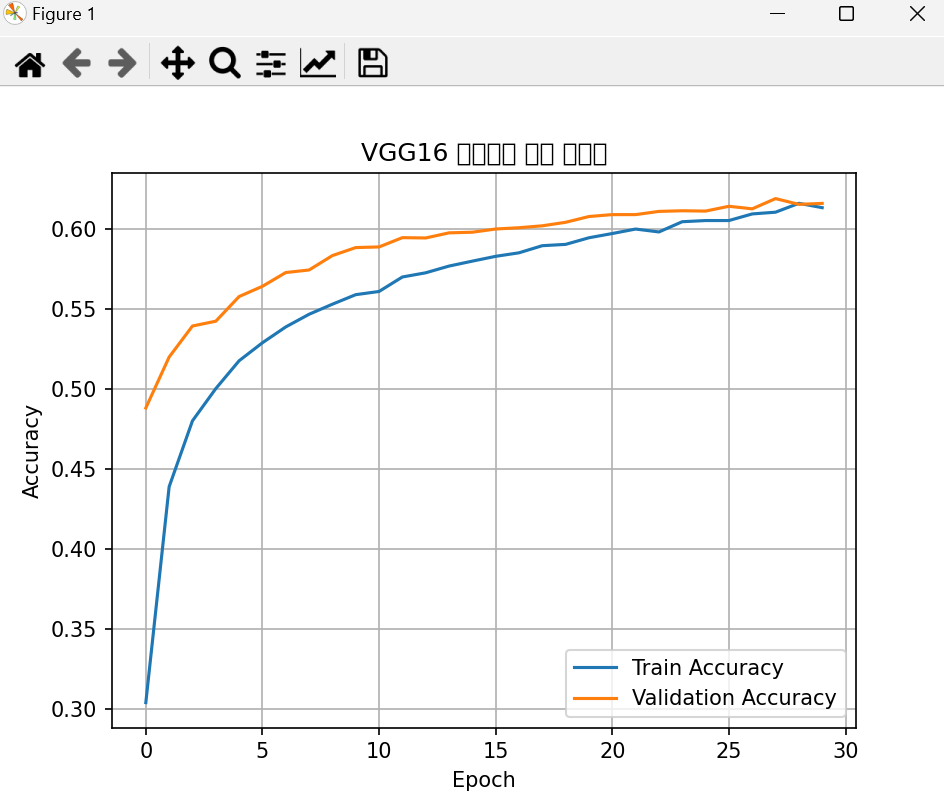
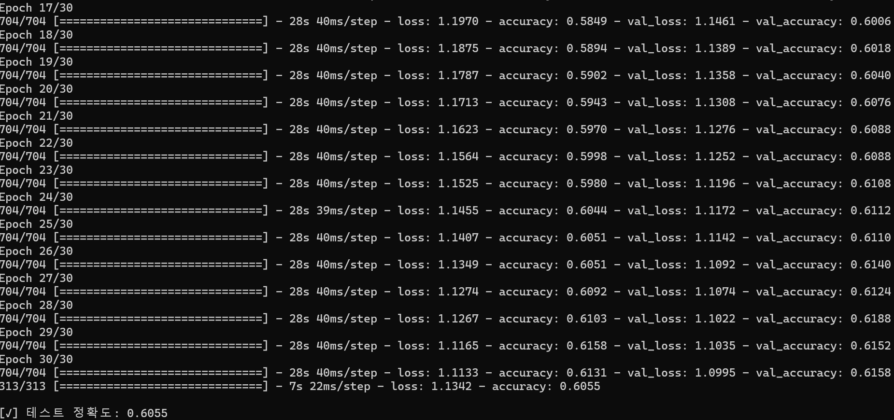

# 📘 이미지 분류기 구현 보고서

---

## 🧠 과제 1: MNIST 손글씨 숫자 분류기

### ✅ 과제 설명  
28x28 픽셀의 흑백 손글씨 숫자 이미지 (MNIST)를 분류하는 간단한 신경망을 구축합니다.

### 🧩 모델 구조  
- `Flatten`: 28x28 → 784 벡터로 변환  
- `Dense(128, relu)`: 은닉층  
- `Dense(10, softmax)`: 숫자 0~9 분류  

### 🔑 주요 코드
```python
model = Sequential([
    Flatten(input_shape=(28, 28)),
    Dense(128, activation='relu'),
    Dense(10, activation='softmax')
])
```

### 📊 학습 결과 그래프


### 🪜 에폭별 정확도


---

## 🖼️ 과제 2: CIFAR-10 CNN 분류기

### ✅ 과제 설명  
32x32 크기의 컬러 이미지로 구성된 CIFAR-10 데이터셋을 활용해 CNN 기반 이미지 분류기를 구현합니다.

### 🧩 모델 구조  
- Conv2D(32) → Conv2D(32) → MaxPooling → Dropout  
- Conv2D(64) → Conv2D(64) → MaxPooling → Dropout  
- Flatten → Dense(512) → Dense(256) → Dense(10)

### 🔑 주요 코드
```python
model = Sequential([
    Conv2D(32, (3,3), activation='relu', input_shape=(32, 32, 3)),
    ...
    Dense(10, activation='softmax')
])
```

### 📷 예측 기능 포함
```python
predict_custom_image("./data/testimg.jpg")
```

### 📊 학습 결과 그래프


### 🪜 에폭별 정확도


### 🧪 테스트 이미지 예측 결과


---

## 🚀 과제 3: VGG16 기반 전이학습 모델

### ✅ 과제 설명  
사전 학습된 VGG16 모델을 기반으로 전이학습을 수행하여 CIFAR-10 데이터셋 분류 성능을 향상시킵니다.

### 🧩 모델 구조  
- `VGG16` (include_top=False, freeze)  
- `Flatten → Dense(256) → Dropout → Dense(10)`

### 🔑 주요 코드
```python
base_model = VGG16(weights='imagenet', include_top=False, input_shape=(32, 32, 3))
for layer in base_model.layers:
    layer.trainable = False
```

### 📊 학습 결과 그래프


### 🪜 에폭별 정확도


### 🧪 테스트 성능


---

## 📌 결론
- **과제 1**은 기본적인 MLP로 98% 이상의 정확도를 달성.  
- **과제 2**는 CNN 구조 도입으로 복잡한 컬러 이미지 분류에서 높은 성능 확보.  
- **과제 3**은 전이학습을 통해 적은 학습량으로도 높은 정확도를 효율적으로 달성함.
