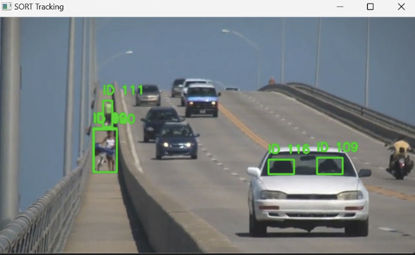
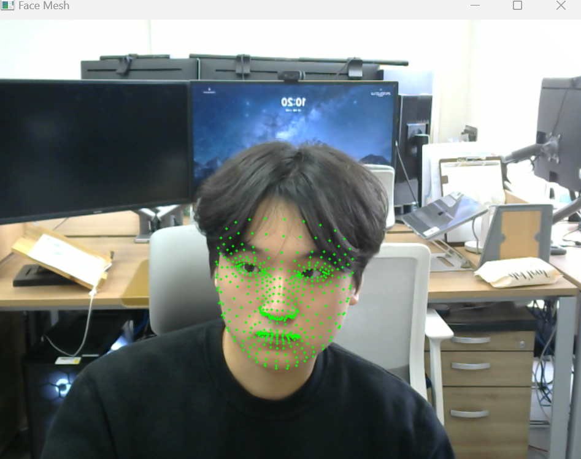

# Computer Vision

1. **YOLOv4 + SORT를 활용한 다중 객체 추적기 구현**
2. **Mediapipe를 활용한 얼굴 랜드마크 추출 및 시각화**

---

## 🧠 과제 1: SORT 알고리즘을 활용한 다중 객체 추적기 구현

### ✔ 설명
- 사전 학습된 **YOLOv4**를 사용하여 객체를 실시간으로 검출하고,
- **SORT (Simple Online and Realtime Tracking)** 알고리즘을 통해 객체 추적을 수행하였습니다.
- 각 객체는 고유한 ID를 부여받아 프레임마다 경계 상자와 함께 시각화됩니다.

### ✔ 구현 주요 사항
- `cv2.dnn`을 통해 YOLOv4 모델 로드 및 추론
- SORT 추적기를 통한 프레임 단위 트래킹
- OpenCV로 실시간 시각화 및 ESC 키 종료

### ✔ 실행 결과
- 결과 영상의 한 프레임 예시는 다음과 같습니다:

  

---

## 🧠 과제 2: Mediapipe를 활용한 얼굴 랜드마크 추출 및 시각화

### ✔ 설명
- **Mediapipe의 FaceMesh 모듈**을 활용하여 얼굴의 **468개 랜드마크**를 검출하고,
- 웹캠을 통해 입력되는 실시간 영상에서 각 랜드마크를 점으로 시각화합니다.

### ✔ 구현 주요 사항
- `mediapipe.solutions.face_mesh`를 통해 얼굴 검출기 초기화
- OpenCV의 `cv2.circle()` 함수를 사용하여 각 랜드마크를 영상에 그리기
- 랜드마크는 정규화 좌표이므로 해상도에 맞게 변환 처리

### ✔ 실행 결과
- 실시간 검출 결과 예시는 다음과 같습니다:

  

